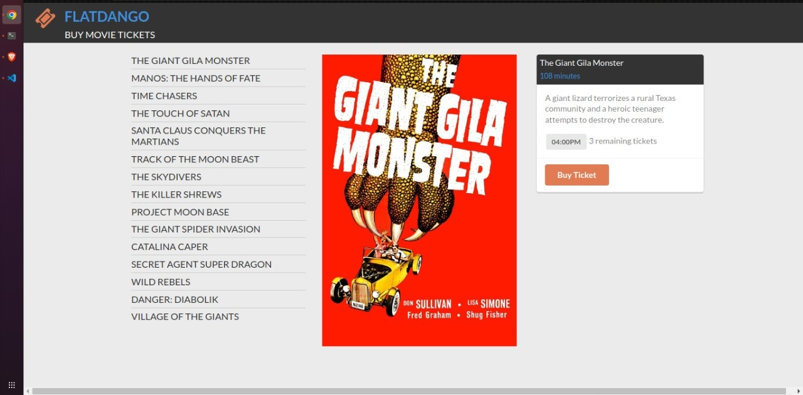

### WEEK 3 CODE CHALLENGE
#### Projects name
    - Flatiron Movie Theater
#### author information
    The following projects are created by:
    - Paul Wanyoike Ngugi
    - on 12/12/2022
#### setup/installation requirements
    - download a zip file under code tab.
    - extract the downloaded zip folder
    - open the folder with VS code
    - run the html file of each of the project application by right clicking on it and clicking 'open with live server.'
    - Run this command to get the backend started:
    ```console $ json-server --watch db.json```
##### project description
    - Flatiron Movie Theater is open for business! You will be building out an 
    application, Flatdango, that allows a user to purchase movie tickets from the 
    theater.
##### BDD
As a user should;
    - See the first movie's details, including its **poster, title, runtime, 
    showtime, and available tickets** when the page loads.
    - See a menu of all movies on the left side of the page in the `ul#films` 
    element when the page loads.
    - Buy a ticket for a movie.
##### Known Bugs
    The application works perfectly well, no bugs.
#### technologies used
    The following projects used the technologies
    :
    - HTML
    - CSS
    - JS
    - JSON
#### Support and Contact information
    Email: paulnyoiken@gmail.com
    Phone: +254718741382
#### License and Copyright Information
Copyright 2021 Paul Wanyoike Ngugi Licensed under[MT License]()


